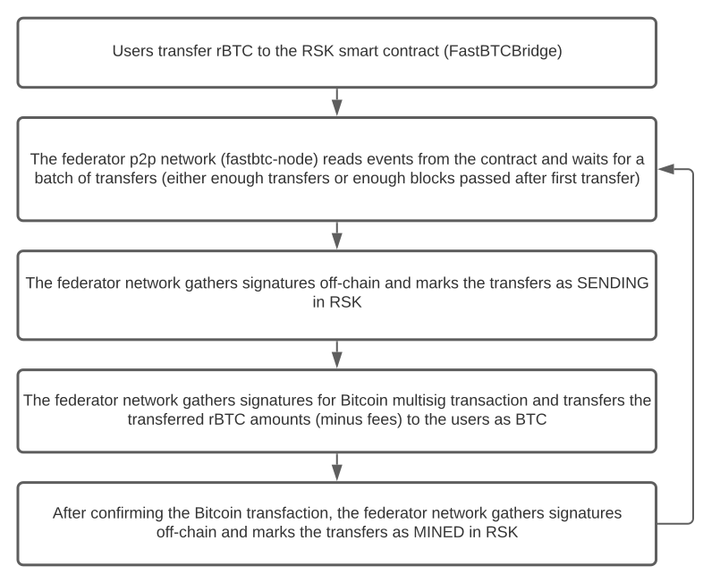

Bi-directional FastBTC
======================

This repo contains the RSK to Bitcoin (rBTC to BTC) version of FastBTC. Despite the name, it does not (yet) handle
Bitcoin to RSK (BTC to rBTC) transfers, as those are handled by the existing FastBTC.

It consists of two major parts:

- `fastbtc-contracts`: A set of RSK smart contracts used to accept rBTC transfers and to track the transfer state to
  the Bitcoin network. Status updates are controlled by a network of federators, where signatures from a majority
  of federators is needed for new updates.
- `fastbtc-node`: The backend service, a federator node that operates in a peer-to-peer network. The network tracks
  rBTC transfers on the contract and obtains a consensus of actions to do, sending BTC from a Bitcoin multisig wallet
  and updating status to the RSK smart contract. Signatures are exchanged off-chain to avoid gas costs, and various
  techniques are used to prevent double-spending.

High-level data flow
--------------------



Unit tests
----------

To run unit tests in all packages, run:

```
make test
```

Integration test
----------------

The repo contains and integration test setup that deploys the contracts to a local Hardhat network, launches a local
Bitcoin network using bitcoind regtest, creates a 2-of-3 multisig wallet on it, and launches a network of 3 federators.
It requires `docker-compose`, and can be launched with:

```
make run-demo-regtest
```

For the first run, it can take ~20-30 minutes to build and start everything -- subsequent startups are faster.
It will output a lot of logs. To only observe federator node logs, run the command `make show-node-logs` (in another
terminal)

After the network has started, you should see output resembling this (with slight variations):

```
fastbtc2-node2-1            | node id:          7eNHnBNMeNxQIcetjAno8R
fastbtc2-node2-1            | initiator id:     1ZFfiFbX7kkMTVOkgj7x1D
fastbtc2-node2-1            | is initiator?     false
fastbtc2-node2-1            | nodes online:     3
fastbtc2-node2-1            | transfers total:  12
fastbtc2-node2-1            | not initiator, not doing anything
```

Note that before the network is fully operational, it's normal to see some messages that look like errors
(e.g. "Invalid signature from server") in the logs.

After the startup is done, you can run an example script that sends a mixture of valid and invalid transfers
(it requires `node.js`, `yarn` and `bitcoin-cli` (available in PATH either as `bitcoin-cli` or `bitcoin-core.cli`):

```
$ make test-transfers
... some yarn/hardhat logs about building ...
User balance before:        0.00000000 BTC
Multisig balance before:    0.00000000 BTC
Replenisher balance before: 550.00000000 BTC

Sending 5 rBTC (5000000000000000000 wei) to 0xB3b77A8Bc6b6fD93D591C0F34f202eC02e9af2e8
tx hash: 0xd3873623deb510a2c6552b9d5f76952aebae9ac55982e5d1b1b8a32df876e3b9
Sending 0.15 rBTC from 0xB3b77A8Bc6b6fD93D591C0F34f202eC02e9af2e8 to BTC address bcrt1qq8zjw66qrgmynrq3gqdx79n7fcchtaudq4rrf2 4 times
...
4 invalid transfers sent, followed by 4 transfers to proper addresses. They should be visible in a couple of minutes
Polling balances, Ctrl-C to exit
User: 0.00000000  Multisig: 0.00000000  Replenisher: 1100.00000000
User: 0.00000000  Multisig: 0.00000000  Replenisher: 1600.00000000
User: 0.00000000  Multisig: 0.00000000  Replenisher: 2100.00000000
...
User: 0.00000000  Multisig: 49.99997522  Replenisher: 5650.00000000
User: 0.59992000  Multisig: 49.40002110  Replenisher: 6200.00000000
User: 0.59992000  Multisig: 49.40002110  Replenisher: 6700.00000000
User: 0.59992000  Multisig: 49.40002110  Replenisher: 7200.00000000
User: 0.59992000  Multisig: 49.40002110  Replenisher: 7550.00002478
```

When the user balance increases, it indicates that the transfers went through properly.
When the multisig balance icreases, it indicates that the multisig was replenished correctly from the replenisher
multisig.
The replenisher balance will increase every block.

Hit Ctrl-C to quit it.

### Advanced details

The test setup (launched with `make run-demo-regtest`) will expose the Hardhat RPC server at `http://localhost:18545`
and the bitcoind regtest RPC server at `http://localhost:18443` (use the `user` RPC wallet, with authentication
`fastbtc`/`hunter2`).

The Hardhat RPC can be interacted with the `integration-test` Hardhat network, e.g.:

```
$ cd packages/fastbtc-contracts
$ yarn && yarn build  # install and compile everything
$ npx hardhat --network integration-test federators
0x4091663B0a7a14e35Ff1d6d9d0593cE15cE7710a
0x09dcD91DF9300a81a4b9C85FDd04345C3De58F48
0xA40013a058E70664367c515246F2560B82552ACb
$ npx hardhat --network integration-test free-money 0xB3b77A8Bc6b6fD93D591C0F34f202eC02e9af2e8 5
Sending 5 rBTC (5000000000000000000 wei) to 0xB3b77A8Bc6b6fD93D591C0F34f202eC02e9af2e8
tx hash: 0x92f9093ce53169223392e4df1d1ac00415b523dd3b7151cbc0f9ed45a5ff6147
```

Or with CURL:

```
$ curl http://localhost:18545 \            
  -s -i -X POST -H "Content-Type: application/json" \
  --data '{"jsonrpc":"2.0","method":"eth_chainId","params":[],"id":1}'
HTTP/1.1 200 OK
Access-Control-Allow-Origin: *
Access-Control-Request-Method: *
Access-Control-Allow-Methods: OPTIONS, GET
Access-Control-Allow-Headers: *
Content-Type: application/json
Date: Mon, 08 Nov 2021 01:28:01 GMT
Connection: keep-alive
Keep-Alive: timeout=5
Content-Length: 42

{"jsonrpc":"2.0","id":1,"result":"0x7a69"}
```


The Bitcoin regtest network can be interacted with using `bitcoin-cli` (see `integration_tests/scripts/bitcoin_cli.sh`)
or with CURL:

```
$ curl http://localhost:18443/wallet/user \
  -s -i -X POST -H "Content-Type: application/json" --user fastbtc:hunter2 \ 
  --data '{"method":"getwalletinfo","params":[],"id":1}'
HTTP/1.1 200 OK
Content-Type: application/json
Date: Mon, 08 Nov 2021 01:27:05 GMT
Content-Length: 425

{"result":{"walletname":"user","walletversion":169900,"format":"bdb","balance":0.59992000,
 "unconfirmed_balance":0.00000000,"immature_balance":0.00000000,"txcount":1,"keypoololdest":1636334208,
 "keypoolsize":1000,"hdseedid":"821e906358e696611f9dc97053c3d3fcace0b475","keypoolsize_hd_internal":1000,
 "paytxfee":0.00000000,"private_keys_enabled":true,"avoid_reuse":false,"scanning":false,"descriptors":false},
 "error":null,"id":1}
```

See also `integration_test/scripts/test_example_transfer.sh`

The RSK Smart contracts (fastbtc-contracts)
-------------------------------------------

For details about the smart contracts, see [packages/fastbtc-contracts/README.md](packages/fastbtc-contracts/README.md).

The P2P network (fastbtc-node)
------------------------------

The package fastbtc-node contains the implementation of the background service. The nodes form a peer-to-peer network,
where they connect to other nodes using pre-configured addresses, and then discover all nodes in the network.

For more in-depth information, see [packages/fastbtc-node/README.md](packages/fastbtc-node/README.md).

### Data flow


UI
--

The project also has an example UI (`fastbtc-ui`) that is not meant for production and should not be a part of any
audit. **It does not currently support the integration test setup out of the box**


A note about secrets and private keys
-------------------------------------

The `integration_test/nodes` directory includes some private keys for the Bitcoin and RSK networks. These are generated
exclusively for the project and are meant to be in Git, but please do not use them with real money.
