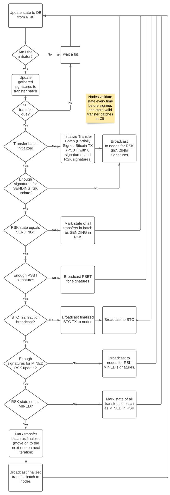

fastbtc-node -- The Bi-directional FastBTC P2P Federator Node
============================================================

This package contains the implementation of the background service. Each node independently validates RSK smart
contract event data and participates in the network by signing RSK update signatures and Bitcoin transactions.

The nodes form a peer-to-peer network, where they connect to other nodes using pre-configured addresses and then
discover all nodes in the network. In the network, the nodes elect an *initiator* node, that has the responsibility
of initiating new actions (gathering signatures and sending transactions to RSK/Bitcoin). The other nodes have a more
passive role, where they update event data from the RSK smart contract to local database and respond to messages
sent by the initiator. The network is built so that the initiator can change at any given time.

Each node is expected to hold a private key to an RSK address that has the `FEDERATOR` role in the
[FastBTCAccessControl](../fastbtc-contracts/contracts/FastBTCAccessControl.sol) contract. When connecting to the
network, other nodes validate the federator status of the node by asking it to sign a challenge message and verifying
that the recovered address is indeed a federator in the smart contract.

Each node is also expected to hold a private key to the Bitcoin multisig used by the network.

When exploring the code, a good starting point is [src/core/node.ts](src/core/node.ts), since it contains the high-level
P2P logic and serves as a starting point for everything. See the data flow image below for a visual representation
of its inner workings.

Configuration
-------------

fastbtc-node is configured using the following environment variables:

```
FASTBTC_DB_URL                       # Full url to postgresql database (postgresq://...)
FASTBTC_PORT                         # Port this node listens to in the network
FASTBTC_KNOWN_PEERS                  # Comma-seprated list of hostname:port combinations for known nodes
FASTBTC_NUM_REQUIRED_SIGNERS         # number of RSK/Bitcoin signatures required for transactions
FASTBTC_MAX_TRANSFERS_IN_BATCH       # maximum number of rBTC->BTC transfers in a single batch
FASTBTC_MAX_PASSED_BLOCKS_IN_BATCH   # maximum number of blocks passed after first transfer in a batch

FASTBTC_RSK_REQUIRED_CONFIRMATIONS   # Number of required confirmations before reading events from RSK
FASTBTC_RSK_RPC_URL                  # RSK JSON RPC url
FASTBTC_RSK_CONTRACT_ADDRESS         # FastBTCBridge contract address in RSK
FASTBTC_RSK_START_BLOCK              # First block to scan events from (contract deployment block)
FASTBTC_RSK_PRIVATE_KEY              # Private key of RSK federator address

FASTBTC_BTC_REQUIRED_CONFIRMATIONS   # Number of required confirmations before a BTC transaction is treated as final
FASTBTC_BTC_NETWORK                  # Bitcoin network type, (mainnet, testnet, or regtest)
FASTBTC_BTC_RPC_URL                  # Full Bitcoin RPC url e.g.  http://localhost:18543/wallet/multisig
FASTBTC_BTC_RPC_USERNAME             # Username for authenticating to bitcoin rpc
FASTBTC_BTC_RPC_PASSWORD             # Password for authenticating to bitcoin rpc
FASTBTC_BTC_MASTER_PUBLIC_KEYS       # Comma-separated list of all public keys used in the bitcoin multisig (tpub...,)
FASTBTC_BTC_MASTER_PRIVATE_KEY       # Hierarchical master private key that has access to bitcoin multisig (tprv...)
FASTBTC_BTC_KEY_DERIVATION_PATH      # (Optional) key derivation path from master private key to sign multisig transactions with
```

For example configurations, see the [integration_test/nodes](../../integration_test/nodes) directory.

Used technologies
----------------

- [TypeScript](https://www.typescriptlang.org/) as the main language
- [PostgreSQL](https://www.postgresql.org/) as the database server
- [Ethers](https://docs.ethers.io/) for RSK interactions
- [bitcoinjs-lib](https://github.com/bitcoinjs/bitcoinjs-lib) for Bitcoin signature magic
- [Ataraxia](https://github.com/aholstenson/ataraxia) for P2P networking
  (note: we use a [vendored version](vendor/ataraxia-core))
- [Inversify](https://inversify.io/) for dependency injection
- [TypeORM](https://typeorm.io/) for database interactions

Running
-------

While not strictly required, fastbtc-node is meant to be run inside Docker. A [Dockerfile](Dockerfile) is provided for
this. See the [root docker-compose-base.yml](../../docker-compose-base.yml) and
[docker-compose-regtest.yml](../../docker-compose-regtest.yml) for examples.


Data flow
---------




Development
-----------

### ABI changes

When the contract ABI (in fastbtc-contracts) changes, update the ABI in this directory:

```
cd ../fastbtc-contracts
yarn build
cd ../fastbtc-node
yarn copy-abi
```

### Migrations

fastbtc-node uses TypeORM for migrations and DB integration.

Migrations are run with `FASTBTC_DB_URL=... yarn migrate:up`. The Docker startup script handles this automatically.
To create new migrations, you need a local PostgreSQL database. First run the migrations against it (like before),
then (after doing necessary changes in `models.ts`), run `FASTBTC_DB_URL=... yarn migrate:generate`.
